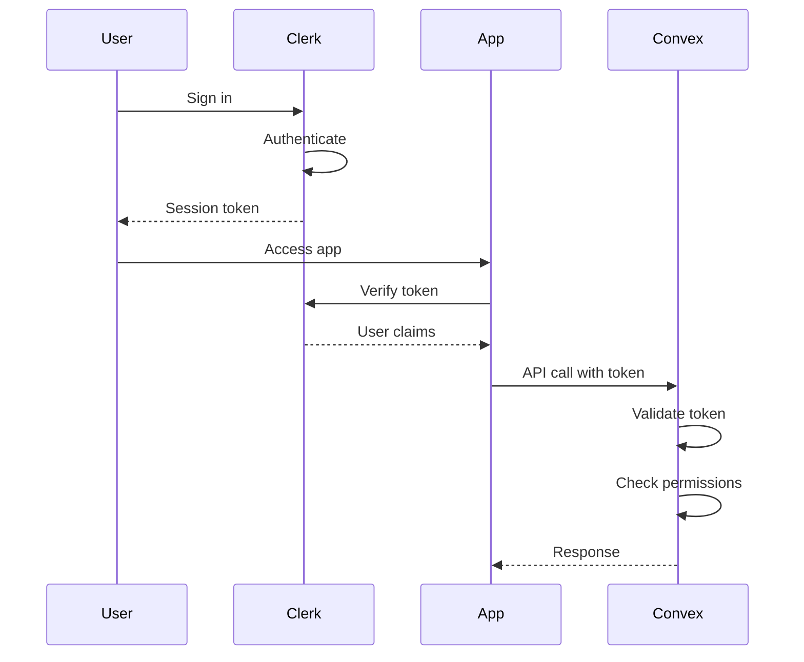

# Backend Architecture

### Service Architecture

#### Function Organization
```
convex/
├── _generated/           # Auto-generated types
├── auth/
│   ├── config.ts        # Clerk configuration
│   └── helpers.ts       # Auth utilities
├── organizations/
│   ├── mutations.ts     # Create/update org
│   └── queries.ts       # Get org data
├── events/
│   ├── mutations.ts     # Event lifecycle
│   └── queries.ts       # Event queries
├── menuItems/
│   ├── mutations.ts     # Menu CRUD
│   └── queries.ts       # Menu queries
├── orders/
│   ├── mutations.ts     # Order processing
│   ├── queries.ts       # Order retrieval
│   └── subscriptions.ts # Real-time updates
└── lib/
    ├── validators.ts    # Zod schemas
    └── audit.ts        # Audit logging
```

#### Function Template
```typescript
// convex/orders/mutations.ts
import { v } from "convex/values"
import { mutation } from "./_generated/server"
import { requireAuth, requireRole } from "../auth/helpers"
import { logAudit } from "../lib/audit"

export const createOrder = mutation({
  args: {
    eventId: v.id("events"),
    tableNumber: v.string(),
    items: v.array(v.object({
      menuItemId: v.id("menuItems"),
      quantity: v.number(),
      specialInstructions: v.optional(v.string()),
    })),
  },
  handler: async (ctx, args) => {
    // Authentication
    const user = await requireAuth(ctx)
    await requireRole(ctx, ["waiter", "admin"])
    
    // Validation
    const event = await ctx.db.get(args.eventId)
    if (!event || event.status !== "active") {
      throw new Error("Event is not active")
    }
    
    // Business logic
    const orderItems = await buildOrderItems(ctx, args.items)
    const total = calculateTotal(orderItems)
    
    // Database operation
    const orderId = await ctx.db.insert("orders", {
      organizationId: user.organizationId,
      eventId: args.eventId,
      tableNumber: args.tableNumber,
      status: "new",
      items: orderItems,
      subtotal: total,
      total,
      paymentStatus: "pending",
      timestamps: { createdAt: Date.now() },
      createdBy: user.clerkId,
    })
    
    // Audit logging
    await logAudit(ctx, {
      action: "order.created",
      entityType: "order",
      entityId: orderId,
      organizationId: user.organizationId,
      userId: user.clerkId,
      newValue: { orderId, tableNumber: args.tableNumber },
    })
    
    return orderId
  },
})
```

### Database Architecture

#### Schema Design
```sql
-- Conceptual SQL representation of document structure
CREATE TABLE organizations (
  _id TEXT PRIMARY KEY,
  name TEXT NOT NULL,
  slug TEXT UNIQUE NOT NULL,
  logo TEXT,
  timezone TEXT NOT NULL,
  currency TEXT NOT NULL,
  settings JSONB NOT NULL,
  created_at TIMESTAMP NOT NULL,
  updated_at TIMESTAMP NOT NULL,
  created_by TEXT NOT NULL
);

CREATE INDEX idx_org_slug ON organizations(slug);
CREATE INDEX idx_org_created_by ON organizations(created_by);

CREATE TABLE orders (
  _id TEXT PRIMARY KEY,
  organization_id TEXT REFERENCES organizations(_id),
  event_id TEXT REFERENCES events(_id),
  table_number TEXT NOT NULL,
  status TEXT NOT NULL,
  items JSONB NOT NULL,
  subtotal INTEGER NOT NULL,
  total INTEGER NOT NULL,
  payment_method TEXT,
  payment_status TEXT NOT NULL,
  special_instructions TEXT,
  timestamps JSONB NOT NULL,
  created_by TEXT NOT NULL,
  completed_by TEXT
);

CREATE INDEX idx_orders_org_event ON orders(organization_id, event_id);
CREATE INDEX idx_orders_event_status ON orders(event_id, status);
CREATE INDEX idx_orders_table ON orders(event_id, table_number);
```

#### Data Access Layer
```typescript
// convex/lib/database.ts
import { QueryCtx, MutationCtx } from "../_generated/server"
import { Id } from "../_generated/dataModel"

export class OrganizationRepository {
  constructor(private ctx: QueryCtx | MutationCtx) {}
  
  async findById(id: Id<"organizations">) {
    return await this.ctx.db.get(id)
  }
  
  async findBySlug(slug: string) {
    return await this.ctx.db
      .query("organizations")
      .withIndex("by_slug", q => q.eq("slug", slug))
      .unique()
  }
  
  async create(data: CreateOrganizationInput) {
    return await this.ctx.db.insert("organizations", {
      ...data,
      createdAt: Date.now(),
      updatedAt: Date.now(),
    })
  }
}

export class OrderRepository {
  constructor(private ctx: QueryCtx | MutationCtx) {}
  
  async findActiveByTable(eventId: Id<"events">, tableNumber: string) {
    return await this.ctx.db
      .query("orders")
      .withIndex("by_table", q => 
        q.eq("eventId", eventId).eq("tableNumber", tableNumber)
      )
      .filter(q => q.neq(q.field("status"), "completed"))
      .collect()
  }
  
  async updateStatus(
    orderId: Id<"orders">,
    status: OrderStatus,
    userId: string
  ) {
    const timestampField = STATUS_TIMESTAMP_MAP[status]
    return await this.ctx.db.patch(orderId, {
      status,
      [`timestamps.${timestampField}`]: Date.now(),
      ...(status === "completed" ? { completedBy: userId } : {}),
    })
  }
}
```

### Authentication and Authorization

#### Auth Flow


#### Middleware/Guards
```typescript
// convex/auth/helpers.ts
import { QueryCtx, MutationCtx } from "../_generated/server"
import { ConvexError } from "convex/values"

export async function requireAuth(
  ctx: QueryCtx | MutationCtx
) {
  const identity = await ctx.auth.getUserIdentity()
  if (!identity) {
    throw new ConvexError("Authentication required")
  }
  
  const user = await ctx.db
    .query("users")
    .withIndex("by_clerk_id", q => 
      q.eq("clerkId", identity.subject)
    )
    .unique()
  
  if (!user || !user.isActive) {
    throw new ConvexError("User not found or inactive")
  }
  
  return user
}

export async function requireRole(
  ctx: QueryCtx | MutationCtx,
  allowedRoles: UserRole[]
) {
  const user = await requireAuth(ctx)
  
  if (!allowedRoles.includes(user.role)) {
    throw new ConvexError(
      `Insufficient permissions. Required: ${allowedRoles.join(", ")}`
    )
  }
  
  return user
}

export async function requireOrganization(
  ctx: QueryCtx | MutationCtx,
  organizationId: Id<"organizations">
) {
  const user = await requireAuth(ctx)
  
  if (user.organizationId !== organizationId) {
    throw new ConvexError("Organization access denied")
  }
  
  return user
}
```

