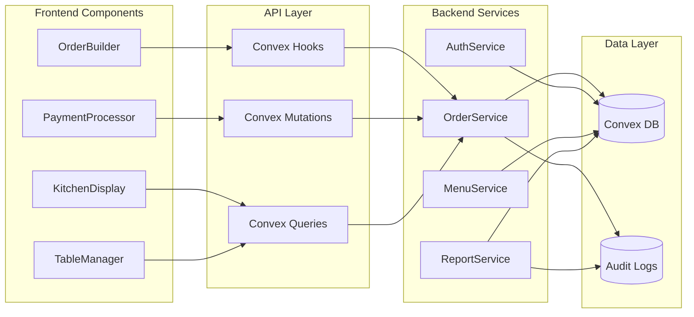

# Components

### Frontend Components

#### OrderBuilder
**Responsibility:** Composite component for building orders with menu selection and cart management

**Key Interfaces:**
- MenuSection: Display categorized menu items
- OrderSummary: Show selected items with quantities
- TableInput: Capture table number
- SubmitButton: Validate and submit order

**Dependencies:** useMenuItems hook, useCreateOrder mutation, React Hook Form

**Technology Stack:** React 18, TypeScript, shadcn/ui components, Tailwind CSS

#### KitchenDisplay
**Responsibility:** Real-time order queue visualization with drag-to-update status

**Key Interfaces:**
- OrderColumn: Display orders by status
- OrderCard: Individual order with items and timer
- StatusUpdate: Handle status transitions

**Dependencies:** useKitchenOrders subscription, useUpdateOrderStatus mutation

**Technology Stack:** React 18, TypeScript, Framer Motion for animations

#### PaymentProcessor
**Responsibility:** Handle payment collection and order completion

**Key Interfaces:**
- OrderSummary: Display order total
- PaymentMethodSelector: Cash/Card selection
- ChangeCalculator: Calculate change for cash
- ReceiptGenerator: Create receipt data

**Dependencies:** useOrder query, useCompletePayment mutation

**Technology Stack:** React 18, TypeScript, React Hook Form with Zod validation

### Backend Components

#### AuthenticationService
**Responsibility:** Manage user authentication and role-based access control

**Key Interfaces:**
- requireAuth: Validate user session
- requireRole: Check role permissions
- requireOrganization: Verify tenant access

**Dependencies:** Clerk SDK, Convex auth utilities

**Technology Stack:** TypeScript, Convex functions, Clerk integration

#### OrderProcessingService
**Responsibility:** Handle order lifecycle from creation to completion

**Key Interfaces:**
- createOrder: Initialize new order
- updateStatus: Transition order states
- calculateTotals: Compute order amounts
- validateItems: Check menu item availability

**Dependencies:** Database queries, audit logging service

**Technology Stack:** TypeScript, Convex mutations, transaction support

#### RealtimeSubscriptionService
**Responsibility:** Manage WebSocket subscriptions for live updates

**Key Interfaces:**
- subscribeToOrders: Kitchen display updates
- subscribeToTables: Table status monitoring
- subscribeToMenu: Menu change notifications

**Dependencies:** Convex query subscriptions, WebSocket management

**Technology Stack:** TypeScript, Convex queries, reactive patterns

### Component Diagrams


