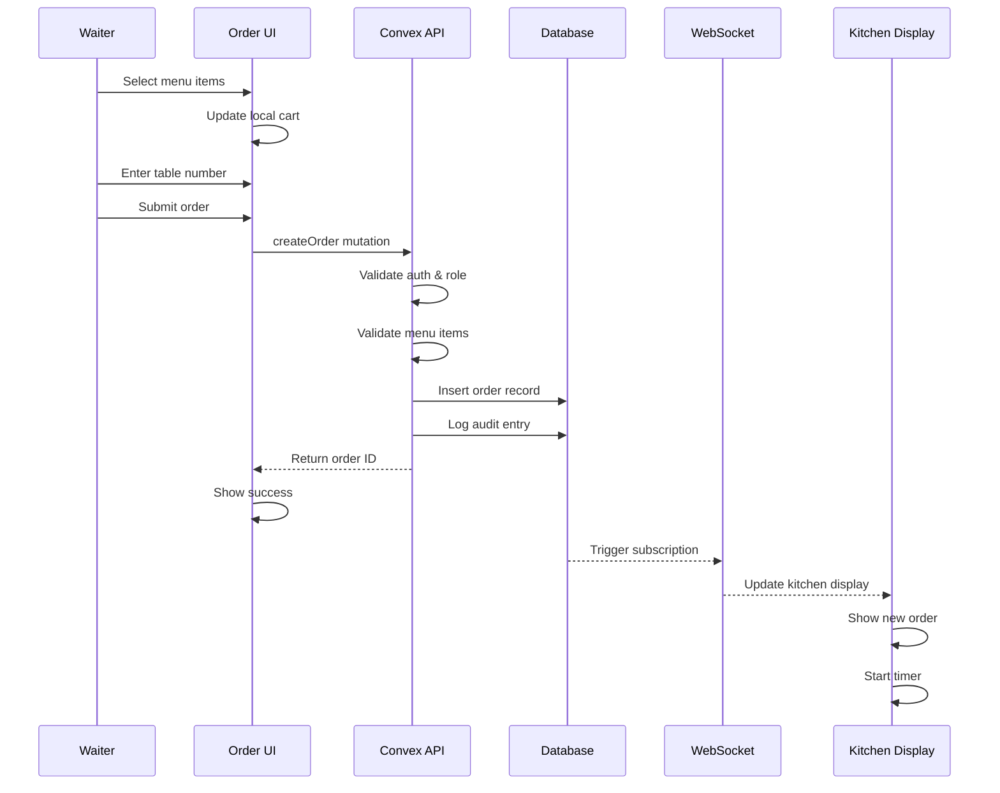
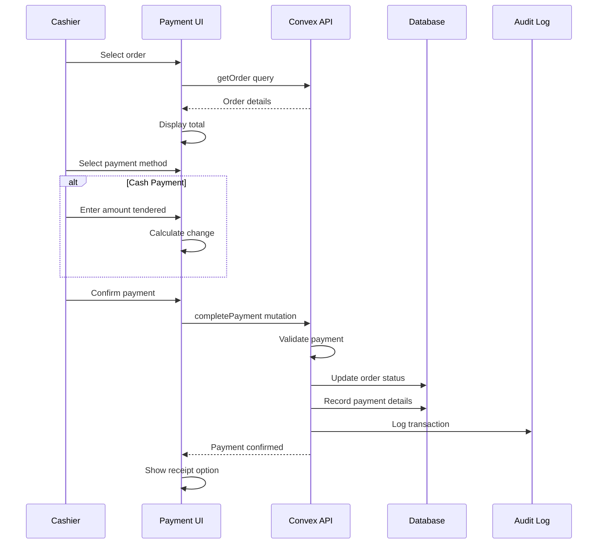
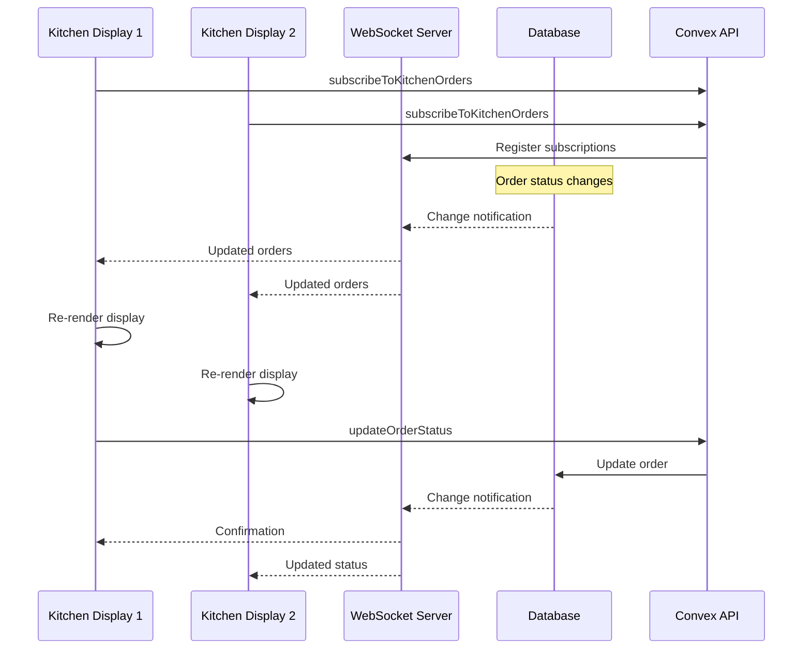

# Core Workflows

### Order Creation Flow

```mermaid
sequenceDiagram
    participant W as Waiter
    participant UI as Order UI
    participant API as Convex API
    participant DB as Database
    participant WS as WebSocket
    participant K as Kitchen Display
    
    W->>UI: Select menu items
    UI->>UI: Update local cart
    W->>UI: Enter table number
    W->>UI: Submit order
    UI->>API: createOrder mutation
    API->>API: Validate auth & role
    API->>API: Validate menu items
    API->>DB: Insert order record
    API->>DB: Log audit entry
    API-->>UI: Return order ID
    UI->>UI: Show success
    DB-->>WS: Trigger subscription
    WS-->>K: Update kitchen display
    K->>K: Show new order
    K->>K: Start timer
```

### Payment Processing Flow

```mermaid
sequenceDiagram
    participant C as Cashier
    participant UI as Payment UI
    participant API as Convex API
    participant DB as Database
    participant AU as Audit Log
    
    C->>UI: Select order
    UI->>API: getOrder query
    API-->>UI: Order details
    UI->>UI: Display total
    C->>UI: Select payment method
    alt Cash Payment
        C->>UI: Enter amount tendered
        UI->>UI: Calculate change
    end
    C->>UI: Confirm payment
    UI->>API: completePayment mutation
    API->>API: Validate payment
    API->>DB: Update order status
    API->>DB: Record payment details
    API->>AU: Log transaction
    API-->>UI: Payment confirmed
    UI->>UI: Show receipt option
```

### Real-Time Kitchen Sync

```mermaid
sequenceDiagram
    participant K1 as Kitchen Display 1
    participant K2 as Kitchen Display 2
    participant WS as WebSocket Server
    participant DB as Database
    participant API as Convex API
    
    K1->>API: subscribeToKitchenOrders
    K2->>API: subscribeToKitchenOrders
    API->>WS: Register subscriptions
    
    Note over DB: Order status changes
    DB-->>WS: Change notification
    WS-->>K1: Updated orders
    WS-->>K2: Updated orders
    K1->>K1: Re-render display
    K2->>K2: Re-render display
    
    K1->>API: updateOrderStatus
    API->>DB: Update order
    DB-->>WS: Change notification
    WS-->>K1: Confirmation
    WS-->>K2: Updated status
```

