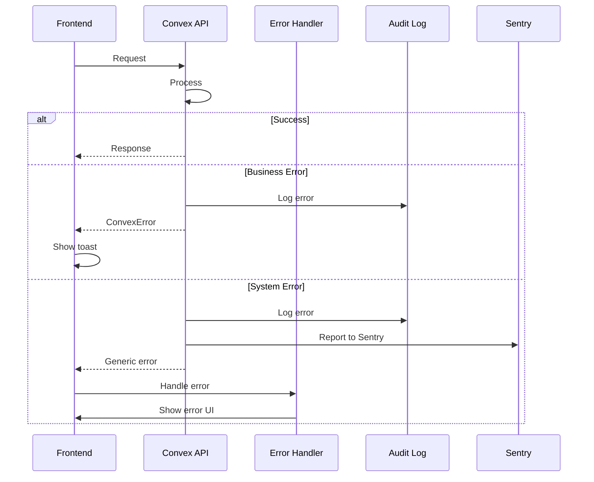

# Error Handling Strategy

### Error Flow


### Error Response Format
```typescript
interface ApiError {
  error: {
    code: string;
    message: string;
    details?: Record<string, any>;
    timestamp: string;
    requestId: string;
  };
}
```

### Frontend Error Handling
```typescript
// lib/error-handler.ts
export function handleError(error: unknown): string {
  if (error instanceof ConvexError) {
    return error.message
  }
  
  if (error instanceof Error) {
    Sentry.captureException(error)
    return "An unexpected error occurred"
  }
  
  return "Something went wrong"
}

// Component usage
try {
  await createOrder(data)
} catch (error) {
  toast({
    title: "Error",
    description: handleError(error),
    variant: "destructive"
  })
}
```

### Backend Error Handling
```typescript
// convex/lib/errors.ts
export class BusinessError extends ConvexError {
  constructor(message: string, public code: string) {
    super(message)
  }
}

export function withErrorHandling<T extends any[], R>(
  fn: (...args: T) => Promise<R>
) {
  return async (...args: T): Promise<R> => {
    try {
      return await fn(...args)
    } catch (error) {
      // Log to audit
      await logError(error)
      
      // Report to Sentry if system error
      if (!(error instanceof ConvexError)) {
        Sentry.captureException(error)
      }
      
      throw error
    }
  }
}
```

