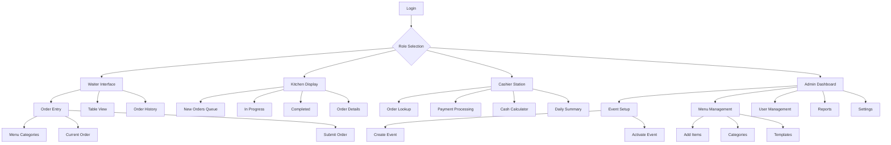
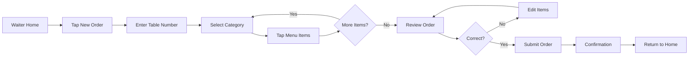
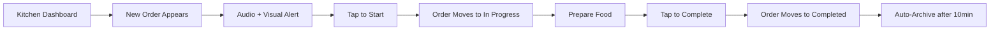
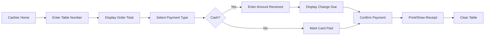
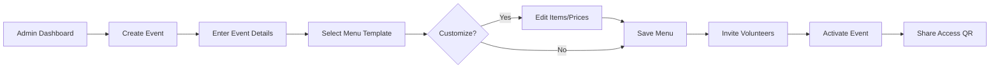

# SimplePOS UI/UX Specification

## Introduction

This document defines the user experience goals, information architecture, user flows, and visual design specifications for SimplePOS's user interface. It serves as the foundation for visual design and frontend development, ensuring a cohesive and user-centered experience.

### Overall UX Goals & Principles

#### Target User Personas

**1. Volunteer Waiter (Primary)**
- Age: 16-70 years old  
- Tech skill: Basic smartphone user
- Context: Works 1-2 events per year, stressed environment
- Needs: Foolproof interface, large buttons, instant feedback
- Pain points: Fear of making mistakes, unfamiliar with POS systems

**2. Kitchen Volunteer**
- Age: 25-65 years old
- Tech skill: Can operate tablet/laptop
- Context: Managing multiple orders simultaneously in hot, busy kitchen
- Needs: Clear visual queue, status tracking, impossible-to-miss notifications
- Pain points: Missing orders, confusion about order priority

**3. Event Organizer/Admin**
- Age: 35-60 years old
- Tech skill: Comfortable with basic software
- Context: Setting up events, training volunteers, managing chaos
- Needs: Quick setup, real-time monitoring, simple reporting
- Pain points: Complex systems, time-consuming training, post-event reconciliation

**4. Cashier Volunteer**
- Age: 18-70 years old
- Tech skill: Basic to intermediate
- Context: Processing payments, calculating change, line management
- Needs: Clear totals, payment tracking, error prevention
- Pain points: Math errors, payment confusion, reconciliation issues

#### Usability Goals

- **2-Minute Proficiency**: New volunteers complete first transaction within 2 minutes
- **Zero Training Documentation**: Interface intuitive enough to use without written guides
- **Error Recovery**: Any mistake reversible within 2 taps
- **Speed of Service**: 40% faster than paper-based methods
- **Stress Reduction**: Visual feedback reduces volunteer anxiety about errors
- **Accessibility**: WCAG AA compliant for users with disabilities

#### Design Principles

1. **Giant Touch Targets First** - Every button minimum 48x48px, critical actions 60x60px
2. **Progressive Disclosure** - Show only current task options, hide complexity
3. **Instant Visual Feedback** - Every tap shows immediate response (color, animation, haptic)
4. **Fail-Safe Design** - Destructive actions require confirmation, easy undo everywhere
5. **Role-Specific Simplicity** - Each role sees only their tools, nothing more

### Change Log

| Date | Version | Description | Author |
|------|---------|-------------|--------|
| 2025-08-24 | 1.0 | Initial UX specification creation | Sally (UX Expert) |

## Information Architecture (IA)

### Site Map / Screen Inventory

### Navigation Structure

**Primary Navigation:** Role-based with locked interfaces. Each role has a distinct color-coded interface with only their required functions visible. No cross-role navigation without logout.

**Secondary Navigation:** Within each role, maximum 2-level depth. Tab-based navigation for main sections, with gesture support for common actions (swipe to confirm, pull to refresh).

**Breadcrumb Strategy:** No breadcrumbs needed due to shallow navigation depth. Clear back buttons and role indicator always visible in header.

## User Flows

### Flow 1: Waiter Takes Order

**User Goal:** Quickly capture customer order and send to kitchen

**Entry Points:** Waiter role home screen, "New Order" button

**Success Criteria:** Order submitted to kitchen in under 60 seconds

#### Flow Diagram

#### Edge Cases & Error Handling:
- No table number entered: Submit button disabled with hint text
- Accidental double-tap: Quantity increases (intentional behavior)
- Network failure: Order queued locally with retry indicator
- Wrong item added: Swipe left to remove or tap X button
- Submitted to wrong table: 30-second undo window

**Notes:** Order modification only available while status is "New" to prevent kitchen confusion

### Flow 2: Kitchen Processes Order

**User Goal:** Track and complete incoming orders efficiently

**Entry Points:** Kitchen display dashboard (always on)

**Success Criteria:** No orders missed, clear status progression

#### Flow Diagram

#### Edge Cases & Error Handling:
- Multiple orders arrive simultaneously: Queue by timestamp, clear numbering
- Accidentally marked complete: 1-minute undo option
- Order cancelled by waiter: Red flash notification, auto-remove
- Screen timeout: Disabled during active event
- Priority orders: Visual distinction for large orders or special requests

**Notes:** Kitchen display optimized for 10" tablet in landscape, high contrast for kitchen lighting

### Flow 3: Cashier Processes Payment

**User Goal:** Accurately process payment and provide change

**Entry Points:** Table number lookup or order selection from list

**Success Criteria:** Payment recorded correctly, change calculated accurately

#### Flow Diagram

#### Edge Cases & Error Handling:
- Split payment: Option to divide between cash/card
- Wrong amount entered: Clear button to re-enter
- Table already paid: Warning message with override option
- Refund needed: Admin approval required
- No orders for table: Clear error message

**Notes:** Change calculator shows denominations to speed up cash handling

### Flow 4: Admin Sets Up Event

**User Goal:** Configure event and menu for volunteer use

**Entry Points:** Admin dashboard after login

**Success Criteria:** Event activated with complete menu in under 10 minutes

#### Flow Diagram

#### Edge Cases & Error Handling:
- Duplicate event names: Auto-append date
- No menu items: Warning before activation
- Volunteer already assigned: Skip invitation
- Event time conflict: Warning with override option
- Template missing: Fallback to blank menu

**Notes:** Templates significantly reduce setup time for recurring events

## Wireframes & Mockups

### Design Files

**Primary Design Files:** Figma designs will be created at [SimplePOS Figma File - TBD]

### Key Screen Layouts

#### Waiter Order Entry Screen (Mobile Portrait)

**Purpose:** Primary interface for taking customer orders

**Key Elements:**
- Header: Organization logo, table number, order total
- Menu grid: 2x3 grid of category buttons (Starters, Mains, Drinks, Desserts, Sides, Specials)
- Item selection: 2-column grid of items with price
- Current order sidebar: Collapsible list with quantities and remove buttons
- Footer: Clear Order and Submit Order buttons

**Interaction Notes:** Single tap adds item, subsequent taps increase quantity. Swipe left on order item to remove. Pull down to refresh menu.

**Design File Reference:** Frame: Waiter/Order-Entry

#### Kitchen Display Dashboard (Tablet Landscape)

**Purpose:** Real-time order tracking for kitchen staff

**Key Elements:**
- Three-column layout: New Orders | In Progress | Completed
- Order cards: Table number (large), items list, timer, status button
- Header: Current time, active orders count, event name
- Audio control: Mute button for alert sounds
- Auto-refresh indicator: Visual pulse every 5 seconds

**Interaction Notes:** Tap card to change status. Long press for order details. Drag between columns as alternative to tapping.

**Design File Reference:** Frame: Kitchen/Display-Dashboard

#### Cashier Payment Screen (Mobile Portrait)

**Purpose:** Process payments and calculate change

**Key Elements:**
- Numpad: Large number buttons for table entry
- Order summary: Items, quantities, total in large font
- Payment toggles: Cash and Card buttons (can select both)
- Cash calculator: Amount received input, change due display
- Action buttons: Cancel, Confirm Payment

**Interaction Notes:** Automatic focus on numpad. Change calculation updates in real-time. Confirmation requires double-tap to prevent errors.

**Design File Reference:** Frame: Cashier/Payment-Processing

#### Admin Event Setup (Responsive)

**Purpose:** Configure events and menus

**Key Elements:**
- Wizard steps: Event Details → Menu Setup → Volunteer Access → Review & Activate
- Menu builder: Drag-drop items between categories
- Template selector: Visual cards with preview
- Volunteer list: Email input with role assignment
- Quick actions: Save as template, Clone previous event

**Interaction Notes:** Auto-save every change. Validation on step completion. Skip steps with defaults for quick setup.

**Design File Reference:** Frame: Admin/Event-Setup

## Component Library / Design System

### Design System Approach

**Design System Approach:** Custom lightweight system based on shadcn/ui components, optimized for touch interfaces and volunteer usability. Components follow iOS/Android patterns familiar to users.

### Core Components

#### BigButton

**Purpose:** Primary action trigger for all user interactions

**Variants:** Primary (blue), Success (green), Danger (red), Neutral (gray)

**States:** Default, Pressed, Disabled, Loading

**Usage Guidelines:** Minimum height 60px on mobile, 48px on desktop. Full-width on mobile, max 200px on desktop. Always include icon with text for clarity.

#### OrderCard

**Purpose:** Display order information consistently across interfaces

**Variants:** Compact (list view), Expanded (detail view), Status (kitchen display)

**States:** New, In Progress, Completed, Cancelled

**Usage Guidelines:** Table number always prominent (24px+). Color-coded border for status. Timer shows in top-right corner.

#### NumberPad

**Purpose:** Numeric input for table numbers and amounts

**Variants:** Full (0-9, decimal, clear), Simple (0-9, clear)

**States:** Active, Disabled

**Usage Guidelines:** Buttons minimum 50x50px. Haptic feedback on tap. Clear button in red. Auto-focus when displayed.

#### MenuTile

**Purpose:** Display menu items and categories

**Variants:** Category (larger, icon), Item (name, price), Unavailable (grayed)

**States:** Default, Selected, Disabled

**Usage Guidelines:** Category tiles 120x120px minimum. Item tiles show price prominently. Quantity badge in top-right when selected.

#### StatusPill

**Purpose:** Show order and event status

**Variants:** Colors mapped to status (green=complete, yellow=progress, red=attention)

**States:** Static, Pulsing (for updates)

**Usage Guidelines:** Always pair with text label. Use sparingly to avoid confusion. Consistent color mapping across all interfaces.

## Branding & Style Guide

### Visual Identity

**Brand Guidelines:** Minimal branding to not compete with organization identity. SimplePOS logo small and subtle. Space for organization logo/colors.

### Color Palette

| Color Type | Hex Code | Usage |
|------------|----------|--------|
| Primary | #2563EB | Primary actions, links, selected states |
| Secondary | #64748B | Secondary text, borders, disabled states |
| Accent | #8B5CF6 | Special features, premium options |
| Success | #10B981 | Confirmations, completed orders, positive feedback |
| Warning | #F59E0B | Pending actions, attention needed, warnings |
| Error | #EF4444 | Errors, destructive actions, urgent alerts |
| Neutral | #F3F4F6, #E5E7EB, #D1D5DB | Backgrounds, borders, dividers |

### Typography

#### Font Families
- **Primary:** System UI fonts (San Francisco, Roboto, Segoe UI)
- **Secondary:** None (use primary with weight variations)
- **Monospace:** System mono (SF Mono, Roboto Mono) for order IDs and codes

#### Type Scale

| Element | Size | Weight | Line Height |
|---------|------|--------|-------------|
| H1 | 32px | 700 | 1.2 |
| H2 | 24px | 600 | 1.3 |
| H3 | 20px | 600 | 1.4 |
| Body | 16px | 400 | 1.5 |
| Small | 14px | 400 | 1.4 |

### Iconography

**Icon Library:** Lucide React (open source, consistent style)

**Usage Guidelines:** Always pair icons with text for clarity. Minimum 24x24px for interactive elements. Use filled variants for selected states.

### Spacing & Layout

**Grid System:** 4px base unit. Components snap to 4px grid. Mobile: 16px padding. Desktop: 24px padding.

**Spacing Scale:** 4, 8, 12, 16, 24, 32, 48, 64, 96px

## Accessibility Requirements

### Compliance Target

**Standard:** WCAG AA compliance minimum, AAA for critical paths

### Key Requirements

**Visual:**
- Color contrast ratios: 4.5:1 for normal text, 3:1 for large text, 7:1 for critical actions
- Focus indicators: 3px solid outline with 2px offset, high contrast color
- Text sizing: Minimum 16px, supports 200% zoom without horizontal scroll

**Interaction:**
- Keyboard navigation: Full keyboard support, logical tab order, skip links
- Screen reader support: Semantic HTML, ARIA labels, live regions for updates
- Touch targets: Minimum 48x48px, 60x60px for primary actions, 8px spacing

**Content:**
- Alternative text: Descriptive alt text for all images and icons
- Heading structure: Logical h1-h6 hierarchy, one h1 per page
- Form labels: Visible labels, placeholder text not used as labels, error messages linked

### Testing Strategy

Regular testing with: NVDA/JAWS screen readers, keyboard-only navigation, Chrome DevTools accessibility audit, real users with disabilities during pilot program

## Responsiveness Strategy

### Breakpoints

| Breakpoint | Min Width | Max Width | Target Devices |
|------------|-----------|-----------|----------------|
| Mobile | 320px | 767px | Phones (portrait) |
| Tablet | 768px | 1023px | Tablets, phones (landscape) |
| Desktop | 1024px | 1919px | Laptops, desktops |
| Wide | 1920px | - | Large displays, TV screens |

### Adaptation Patterns

**Layout Changes:** Mobile: Single column, stacked elements. Tablet: 2-column where appropriate. Desktop: Multi-column, sidebars visible.

**Navigation Changes:** Mobile: Bottom tab bar for role functions. Tablet: Side navigation drawer. Desktop: Persistent sidebar navigation.

**Content Priority:** Mobile: Hide descriptions, show only essential info. Tablet: Show more context. Desktop: Full information display.

**Interaction Changes:** Mobile: Touch gestures, swipe actions. Tablet: Touch + hover states. Desktop: Mouse optimized, keyboard shortcuts.

## Animation & Micro-interactions

### Motion Principles

Follow Material Design motion: purposeful, focused, expressive. Duration: 200-300ms for micro-interactions, 300-400ms for page transitions. Easing: ease-out for enters, ease-in for exits, ease-in-out for moves.

### Key Animations

- **Button Press:** Scale 0.95, duration: 150ms, easing: ease-out
- **Order Submission:** Slide up + fade, duration: 300ms, easing: ease-out
- **Status Change:** Color transition + pulse, duration: 400ms, easing: ease-in-out
- **Error Shake:** Horizontal shake 3x, duration: 300ms, easing: linear
- **Loading Spinner:** Rotate 360°, duration: 1000ms, easing: linear infinite
- **Card Appear:** Fade in + slide up 20px, duration: 250ms, easing: ease-out
- **Tab Switch:** Slide horizontal, duration: 200ms, easing: ease-in-out

## Performance Considerations

### Performance Goals

- **Page Load:** < 2 seconds on 4G, < 1 second on WiFi
- **Interaction Response:** < 100ms for visual feedback
- **Animation FPS:** Consistent 60fps for all animations

### Design Strategies

- Lazy load images and non-critical components
- Use CSS transforms instead of position changes
- Implement virtual scrolling for long lists
- Optimize images: WebP format, responsive sizes
- Minimize animation on low-end devices
- Progressive enhancement: Core functionality works without JS
- Offline-first: Cache critical assets, queue actions when offline

## Next Steps

### Immediate Actions

1. Create high-fidelity mockups in Figma based on these specifications
2. Build interactive prototype for user testing with volunteers
3. Conduct usability testing sessions with target age groups
4. Refine touch target sizes based on testing feedback
5. Develop component library in Storybook
6. Create accessibility testing checklist
7. Document gesture patterns and interactions

### Design Handoff Checklist

- [x] All user flows documented
- [x] Component inventory complete
- [x] Accessibility requirements defined
- [x] Responsive strategy clear
- [x] Brand guidelines incorporated
- [x] Performance goals established

## Checklist Results

_UI/UX Checklist to be run once visual designs are complete_