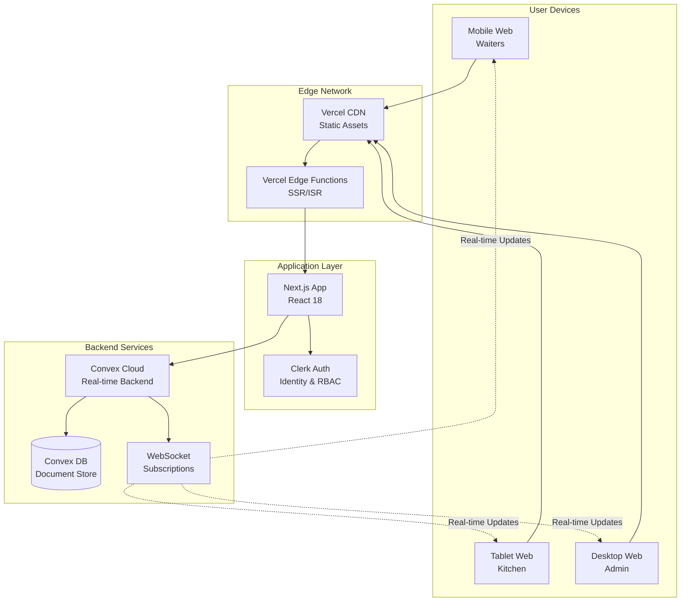

# High Level Architecture

### Technical Summary

SimplePOS is a serverless, real-time point-of-sale system built on Next.js 14+ for the frontend and Convex for the backend, deployed on Vercel's edge network. The architecture leverages Convex's real-time subscriptions for instant order updates across devices, Clerk for secure multi-tenant authentication, and shadcn/ui for accessible, mobile-first interfaces. The system supports 30 concurrent users per event with sub-second latency through edge computing and optimized WebSocket connections. This architecture achieves PRD goals by providing volunteer-friendly interfaces with enterprise-grade reliability, complete audit trails for financial compliance, and zero infrastructure management overhead through serverless deployment.

### Platform and Infrastructure Choice

**Platform:** Vercel + Convex Cloud
**Key Services:** Vercel Edge Functions, Convex Real-time Database, Clerk Auth, Vercel CDN
**Deployment Host and Regions:** Vercel Global Edge Network (auto-selected based on user location)

**Rationale:** This combination provides:
- Zero infrastructure management with automatic scaling
- Built-in real-time capabilities without WebSocket server management
- Edge deployment for minimal latency globally
- Integrated development experience with hot reloading
- Cost-effective for event-based usage patterns

### Repository Structure

**Structure:** Monorepo with simple-pos subfolder
**Monorepo Tool:** npm workspaces (built into npm 7+)
**Package Organization:** Single application package with shared utilities

```
SimplePOS/
├── simple-pos/                 # Main application
│   ├── app/                   # Next.js App Router
│   ├── components/            # React components
│   ├── convex/               # Backend functions
│   ├── hooks/                # Custom React hooks
│   └── lib/                  # Shared utilities
├── docs/                      # Architecture and documentation
└── .bmad-core/               # BMAD agent configuration
```

### High Level Architecture Diagram



### Architectural Patterns

- **Serverless Architecture:** All backend logic runs as Convex functions with automatic scaling - _Rationale:_ Zero infrastructure management and cost-effective for event-based usage
- **Real-Time Subscriptions:** WebSocket-based live queries for instant UI updates - _Rationale:_ Critical for kitchen display and order status synchronization
- **Edge Rendering:** Next.js ISR with edge runtime for optimal performance - _Rationale:_ Sub-2-second page loads on mobile devices globally
- **Component-Based UI:** Atomic design with shadcn/ui components - _Rationale:_ Consistent, accessible interfaces with minimal bundle size
- **Type-Safe RPC:** End-to-end TypeScript with Convex code generation - _Rationale:_ Eliminates runtime errors and improves developer velocity
- **Multi-Tenant Isolation:** Organization-first data model with row-level security - _Rationale:_ Complete data isolation for financial compliance
- **Optimistic Updates:** UI updates before server confirmation - _Rationale:_ Instant feedback for volunteer users on slow connections
- **Event Sourcing:** Complete audit trail of all state changes - _Rationale:_ Financial compliance and debugging capabilities

